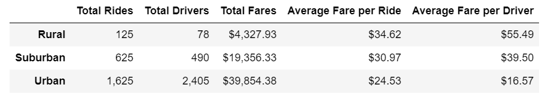
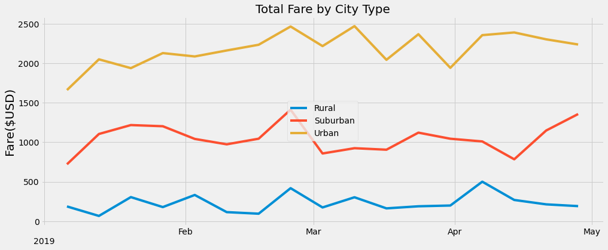

# PyBer Analysis

## Overview of the analysis
My analysis is supposed to help PyBer CEO to improve their ride-sharing services in terms of access as well as affordability across rural, suburban, and urban cities.

## Results
### Services are rare and expensive outside urban area
The table and plot below show that PyBer services are rare and expensive in suburban and rural cities: number of drivers is 5 and 30 times less than in the urban cities, respectively; the average fare is more than 2 and 3 times higher, respectively.

### Revenue is lower outside urban area
The revenue is also much lower beyond urban area: 2 times lower in the suburban area and more than 9 times lower in rural area than in urban area.

### Services are less popular outside urban area
It's not a surprise that PyBer services are less popular in suburban cities: 2.5 times less rides there than in urban cities. And PyBer is much less popular in rural area: 13 times less rides there than in urban area.

### There are no per capita metrics
Unfortunately, I wasn't provided with any data about the population of these areas. Per capita figures could be less dramatic.

## Summary
I recommend to PyBer CEO the following:
1. They should improve the company's database by adding population data to it. It will enable analysts to focus on per capita metrics.
2. PyBer commission should be lowered for suburban and rural rides for a prolonged period until per capita metrics are aligned across the areas.
3. PyBer commission should be fine-tuned to align seasonal imbalances between areas. For example, during urban peaks as in late February and March, or during April decline in Rural and Urban areas and increase in Suburban area.
